# CITE-seq analysis proof-of-concept
Patrick Cherry
2024-06-20

- [Intro](#intro)
- [Read in data](#read-in-data)
- [Seurat object & cluster](#seurat-object--cluster)
- [Incorporate protein expression (antibody barcodes) to the Seurat
  object](#incorporate-protein-expression-antibody-barcodes-to-the-seurat-object)
- [differential protein levels between
  clusters](#differential-protein-levels-between-clusters)

``` r
fs::dir_ls(data_dir) |> fs::path_file()
```

    [1] "GSE100866_CBMC_8K_13AB_10X-ADT_clr-transformed.csv.gz"
    [2] "GSE100866_CBMC_8K_13AB_10X-ADT_umi.csv.gz"            
    [3] "GSE100866_CBMC_8K_13AB_10X-RNA_umi.csv.gz"            
    [4] "GSE100866_CD8_merged-ADT_clr-transformed.csv.gz"      
    [5] "GSE100866_CD8_merged-ADT_umi.csv.gz"                  
    [6] "GSE100866_CD8_merged-RNA_umi.csv.gz"                  
    [7] "GSE100866_PBMC_vs_flow_10X-ADT_clr-transformed.csv.gz"
    [8] "GSE100866_PBMC_vs_flow_10X-ADT_umi.csv.gz"            
    [9] "GSE100866_PBMC_vs_flow_10X-RNA_umi.csv.gz"            

``` r
path(out_path, file_prefix)
```

    /Users/patrick/bfx git projects/CITE-seq/2024-06-20/CITE-seq

## Intro

CITE-seq using data from Stoeckius, et al (Nat Methods 14, 865–868
(2017) 10.1038/nmeth.4380) in GSE100866

Seurat multi-modal clustering

<!-- https://cran.r-project.org/web/packages/dsb/vignettes/end_to_end_workflow.html -->
<!-- https://broadinstitute.github.io/2020_scWorkshop/cite-seq.html -->

### Methods Intro

From [Supplementary Figure 1 CITE-seq library
preparation](https://www.nature.com/articles/nmeth.4380#Sec18):

> Illustration of the DNA-barcoded antibodies used in CITE-seq. (b)
> Antibody-oligonucleotide complexes appear as a high-molecular-weight
> smear when run on an agarose gel (1). Cleavage of the oligo from the
> antibody by reduction of the disulfide bond collapses the smear to
> oligo length (2). (c) Drop-seq beads are microparticles with
> conjugated oligonucleotides comprising a common PCR handle, a cell
> barcode, followed by a unique molecular identifier (UMI) and a polyT
> tail. (d) Schematic illustration of CITE-seq library prep in Drop-seq
> (downstream of Fig. 1b). Reverse transcription and template switch is
> performed in bulk after emulsion breakage. After amplification, full
> length cDNA and antibody-oligo products can be separated by size and
> amplified independently (also shown in d) (e) Reverse transcription
> and amplification produces two product populations with distinct sizes
> (left panel). These can be size separated and amplified independently
> to obtain full length cDNAs (top panel, capillary electrophoresis
> trace) and ADTs (bottom panel, capillary electrophoresis trace).

``` r
source("CITE-seq_data_fetch.R")
```

``` r
cat(readLines("CITE-seq_data_fetch.R"), sep = "\n")
```

    if(!require(GEOquery)){BiocManager::install("GEOquery")}
    library(GEOquery)
    library(fs)

    # https://www.ncbi.nlm.nih.gov/geo/query/acc.cgi?acc=GSE100866
    # https://www.nature.com/articles/nmeth.4380#article-info

    gse_id <- "GSE100866"

    gse <- getGEO(gse_id, GSEMatrix = TRUE)
    show(gse)

    filePaths <- getGEOSuppFiles(gse_id)

    fs::file_delete(fs::path("data", gse_id, fs::path_file(fs::dir_ls(gse_id))))
    fs::file_move(fs::path(gse_id), "data")

## Read in data

### count data

``` r
cbmc_rna <-
  as.sparse(
    read.csv(
      path(data_dir, "GSE100866_CBMC_8K_13AB_10X-RNA_umi.csv.gz"),
      sep = ",", header = TRUE, row.names = 1))
```

``` r
dim(cbmc_rna)
```

    [1] 36280  8617

`dim()` outputs (columns, rows); the CBMC matrix (cord blood mononuclear
cells) contains 36280 features and 8617 samples (single cell droplets).

``` r
cbmc_rna <- CollapseSpeciesExpressionMatrix(cbmc_rna,
                                            prefix = "HUMAN_", controls = "MOUSE_",
                                            ncontrols = 100)
```

``` r
dim(cbmc_rna)
```

    [1] 20501  8617

`CollapseSpeciesExpressionMatrix()` is a convenience function for
slimming down a multi-species expression matrix, when only one species
is primarily of interest. Given the default parameter of
`ncontrols = 100`, this command keeps only the top 100 features detected
from each species in each sample. This matrix went from 36280 to 20501
features, which is a 43% reduction.

### ADT UMI matrix

``` r
cbmc_adt <-
  as.sparse(
    read.csv(
      path(data_dir, "GSE100866_CBMC_8K_13AB_10X-ADT_umi.csv.gz"),
      sep = ",", header = TRUE, row.names = 1))
```

``` r
dim(cbmc_adt)
```

    [1]   13 8617

#### Quick matrix QC

``` r
testthat::expect_equal(dim(cbmc_rna)[2] == dim(cbmc_adt)[2],
                       TRUE)
```

The number of rows (samples / UMIs) matches the RNA counts matrix; we
have corresponding sample data.

``` r
length(intersect(colnames(cbmc_rna), colnames(cbmc_adt))) /
  length(union(colnames(cbmc_rna), colnames(cbmc_adt)))
```

    [1] 1

And the names of the samples all match.

## Seurat object & cluster

``` r
cbmc <- CreateSeuratObject(counts = cbmc_rna)
```

    Warning: Feature names cannot have underscores ('_'), replacing with dashes
    ('-')

``` r
cbmc <- NormalizeData(cbmc)
```

    Normalizing layer: counts

``` r
cbmc <- FindVariableFeatures(cbmc)
```

    Finding variable features for layer counts

``` r
cbmc <- ScaleData(cbmc)
```

    Centering and scaling data matrix

``` r
cbmc <- RunPCA(cbmc, verbose = FALSE)
ElbowPlot(cbmc, ndims = 50)
```


The elbow plot above shows some interesting PC influence behavior. There
are some clusters PCs (like 4-7, 8-10, and 11-13) that make it less
clear where the “elbow” of influence trend is. To be very safe, we can
keep up to PC 25, where the trend approaches a horizontal line.

``` r
cbmc <- FindNeighbors(cbmc, dims = 1:25)
```

    Computing nearest neighbor graph

    Computing SNN

``` r
cbmc <- FindClusters(cbmc, resolution = 0.8)
```

    Modularity Optimizer version 1.3.0 by Ludo Waltman and Nees Jan van Eck

    Number of nodes: 8617
    Number of edges: 343912

    Running Louvain algorithm...
    Maximum modularity in 10 random starts: 0.8613
    Number of communities: 19
    Elapsed time: 0 seconds

``` r
cbmc <- RunTSNE(cbmc, dims = 1:25, method = "FIt-SNE")
```

``` r
cbmc_rna_markers <-
  FindAllMarkers(cbmc,
                 max.cells.per.ident = 100, logfc.threshold = log(2),
                 only.pos = TRUE, min.diff.pct = 0.3, verbose = FALSE)
```

The following cluster identities are provided for us from the authors of
the paper. A cell-type classifier would need to be run on the data to
label the barcodes (droplets) with their identifiers.

``` r
new.cluster.ids <- c("Memory CD4 T", "CD14+ Mono", "Naive CD4 T", "NK", "CD14+ Mono",
                    "Mouse", "B", "CD8 T", "CD16+ Mono", "T/Mono doublets", "NK", "CD34+",
                    "Multiplets", "Mouse", "Eryth", "Mk", "Mouse", "DC", "pDCs")
names(new.cluster.ids) <- levels(cbmc)
cbmc <- RenameIdents(cbmc, new.cluster.ids)
```

### Clustering t-SNE plot

``` r
DimPlot(cbmc, label = TRUE, reduction = "tsne")# + NoLegend()
```


## Incorporate protein expression (antibody barcodes) to the Seurat object

``` r
cbmc[["ADT"]] <- CreateAssayObject(counts = cbmc_adt)
```

The above code adds a new assay called “ADT” to the Seurat object
`cmbc`. We can confirm it’s added with the following `GetAssayData()`
command.

``` r
GetAssayData(cbmc, layer = "counts", assay = "ADT")[1:3,1:3]
```

    3 x 3 sparse Matrix of class "dgCMatrix"
        CTGTTTACACCGCTAG CTCTACGGTGTGGCTC AGCAGCCAGGCTCATT
    CD3               60               52               89
    CD4               72               49              112
    CD8               76               59               61

``` r
rownames(cbmc_adt)
```

     [1] "CD3"    "CD4"    "CD8"    "CD45RA" "CD56"   "CD16"   "CD10"   "CD11c" 
     [9] "CD14"   "CD19"   "CD34"   "CCR5"   "CCR7"  

Now we can repeat the pre-processing (normalization and scaling) steps
that we typically run with RNA, but modifying the ‘assay’ argument.

(For CITE-seq data, the Broad does not recommend typical
LogNormalization. Instead, they use a centered log-ratio (CLR)
normalization, computed independently for each feature. This is a
slightly improved procedure from the original publication.)

``` r
cbmc <- NormalizeData(cbmc, assay = "ADT", normalization.method = "CLR")
```

    Normalizing across features

``` r
cbmc <- ScaleData(cbmc, assay = "ADT")
```

    Centering and scaling data matrix

``` r
DefaultAssay(cbmc) <- "RNA"
```

### Visualize protein levels on RNA clusters

``` r
FeaturePlot(cbmc, features = c("adt_CD3", "adt_CD11c", "adt_CD8", "adt_CD16",
                               "CD3E", "ITGAX", "CD8A", "FCGR3A"),
            min.cutoff = "q05", max.cutoff = "q95", ncol = 4)
```

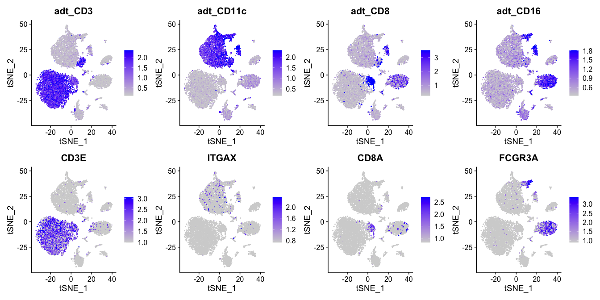

``` r
# Compare gene and protein expression levels for the other 6 antibodies.
FeaturePlot(cbmc,
            features = c("adt_CD4", "adt_CD45RA", "adt_CD56",
                         "adt_CD14", "adt_CD19", "adt_CD34",
                         "CD4", "PTPRC", "NCAM1",
                         "CD14", "CD19", "CD34"),
            min.cutoff = "q05", max.cutoff = "q95", ncol = 6)
```

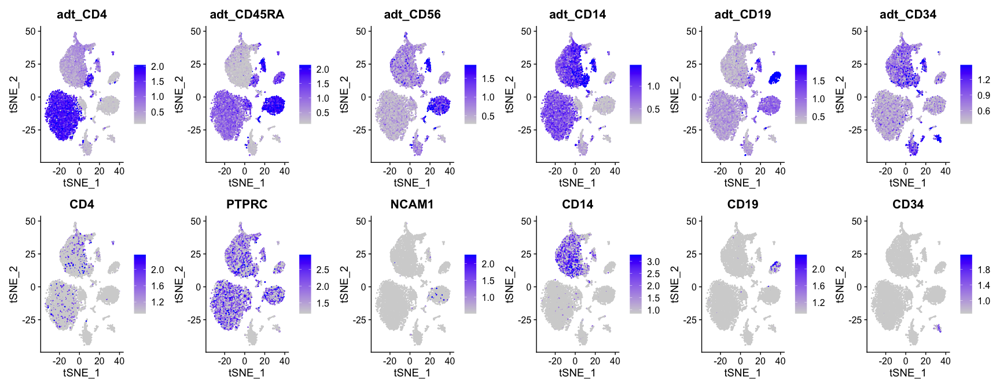

``` r
RidgePlot(cbmc, features = c("adt_CD3", "adt_CD11c", "adt_CD8", "adt_CD16"), ncol = 2)
```


``` r
FeatureScatter(cbmc, feature1 = "adt_CD19", feature2 = "adt_CD3")
```

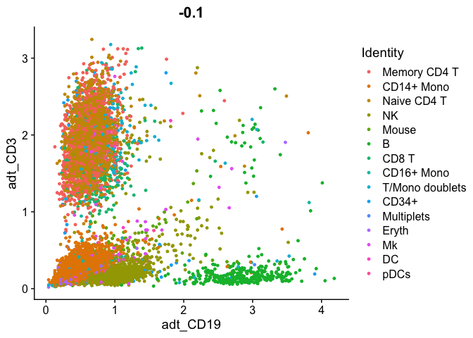

``` r
FeatureScatter(cbmc, feature1 = "adt_CD3", feature2 = "CD3E")
```

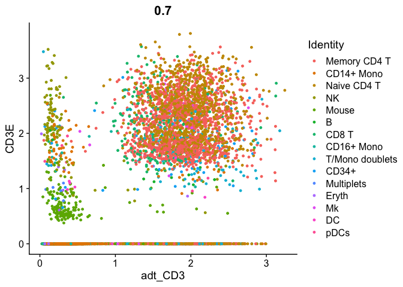

``` r
FeatureScatter(cbmc, feature1 = "adt_CD4", feature2 = "CD4")
```

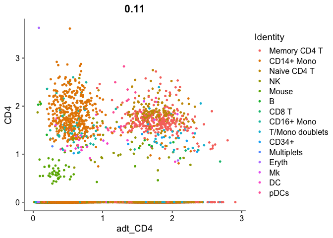

### T-cell analysis

``` r
tcells <- subset(cbmc, idents = c("Naive CD4 T", "Memory CD4 T", "CD8 T"))
FeatureScatter(tcells, feature1 = "adt_CD4", feature2 = "adt_CD8")
```


The pearson correlation of CD4 and CD8 antibody CITE-seq signal is
-0.79, indicating these are signals are significantly anti-correlated,
which is consistent with the immunology of T-cells.

``` r
FeatureScatter(tcells, feature1 = "adt_CD4", feature2 = "adt_CD8", slot = "counts")
```

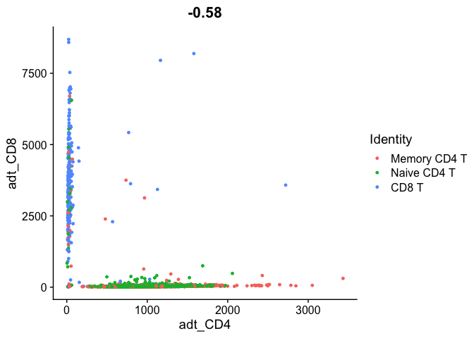

``` r
FeatureScatter(tcells, feature1 = "CD4", feature2 = "CD8A");
```

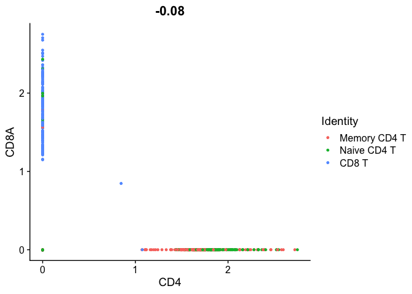

``` r
ncol(subset(tcells, subset = CD4 == 0 & CD8A == 0)) / ncol(tcells)
```

    [1] 0.8285455

Wow, when measured by RNA expression, 83% of the T-cells are
double-negative for CD4 and CD8.

``` r
DefaultAssay(tcells) <- "ADT"  # work with ADT count matrix
FeatureScatter(tcells, feature1 = "adt_CD4", feature2 = "adt_CD8")
```

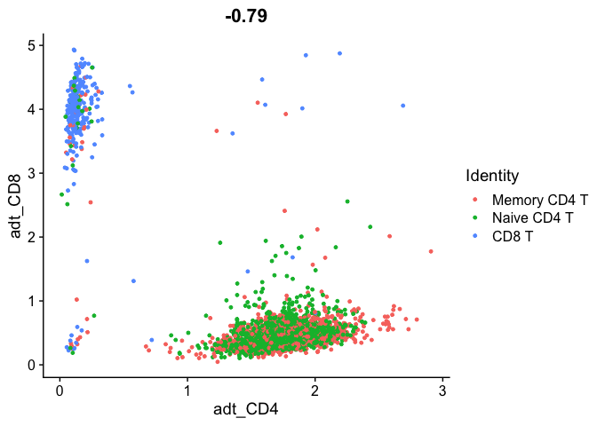

``` r
ncol(subset(tcells, subset = adt_CD4 < 1 & adt_CD8 < 1)) / ncol(tcells)
```

    [1] 0.009978833

However, for surface antigen detection in CITE-seq, only 0.997% are
double negative for CD4 protein and CD8 protein.

## differential protein levels between clusters

Here, I sample 300 sells

``` r
cbmc_subset <- subset(cbmc, downsample = 300)

# Find protein markers for all clusters, and draw a heatmap
adt_markers <- FindAllMarkers(cbmc_subset, assay = "ADT", only.pos = TRUE)
```

    Calculating cluster Memory CD4 T

    Calculating cluster CD14+ Mono

    Calculating cluster Naive CD4 T

    Calculating cluster NK

    Calculating cluster Mouse

    Calculating cluster B

    Calculating cluster CD8 T

    Calculating cluster CD16+ Mono

    Calculating cluster T/Mono doublets

    Calculating cluster CD34+

    Calculating cluster Multiplets

    Calculating cluster Eryth

    Warning in FindMarkers.default(object = data.use, cells.1 = cells.1, cells.2 =
    cells.2, : No features pass logfc.threshold threshold; returning empty
    data.frame

    Calculating cluster Mk

    Calculating cluster DC

    Calculating cluster pDCs

``` r
DoHeatmap(cbmc_subset,
          features = unique(adt_markers$gene),
          assay = "ADT", angle = 90, size = 4) +
  #NoLegend() +
  guides(color = "none") +
  theme(axis.text.y = element_text(size = 14),
        strip.text = element_text(size = 2))
```

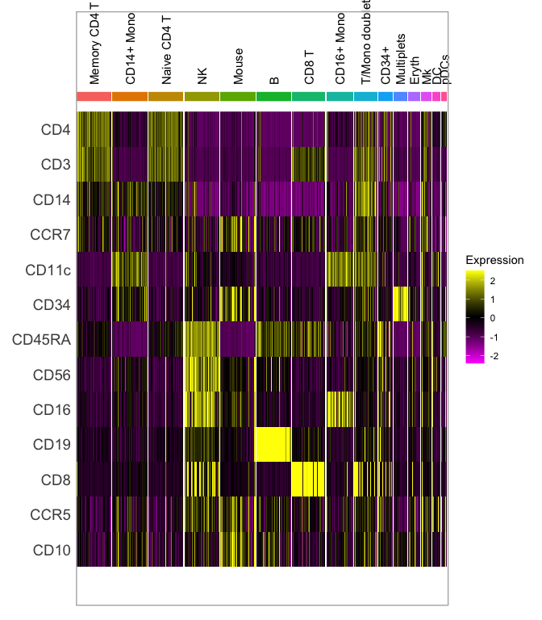

### Cluster directly on protein levels

Keeping human cells only:

``` r
cbmc <- subset(cbmc, idents = c("Multiplets", "Mouse"), invert = TRUE)
```

``` r
DefaultAssay(cbmc) <- "ADT"
cbmc <-
  RunPCA(cbmc,
         features = rownames(cbmc),
         reduction.name = "pca_adt", reduction.key = "pcaadt_",
         verbose = FALSE)
```

    Warning in irlba(A = t(x = object), nv = npcs, ...): You're computing too large
    a percentage of total singular values, use a standard svd instead.

I’m using `reduction.name` and `reduction.key`, because this is the
second PCA being run on this multi-modal Seurat object, and I don’t want
the names to collide with the scRNA-seq PCA.

``` r
DimPlot(cbmc, reduction = "pca_adt")
```

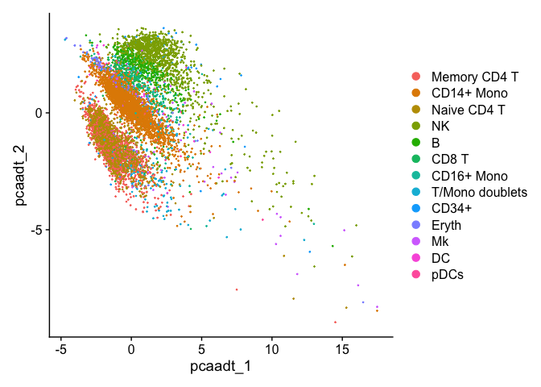

``` r
ElbowPlot(cbmc)
```

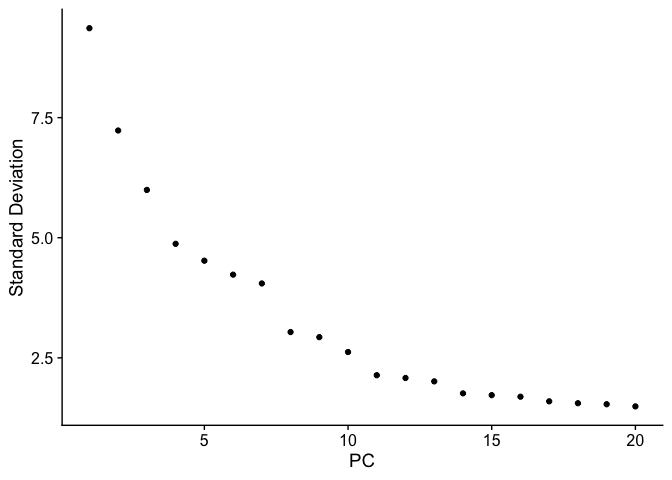

``` r
adt_data <- GetAssayData(cbmc, slot = "data")
```

    Warning: The `slot` argument of `GetAssayData()` is deprecated as of SeuratObject 5.0.0.
    ℹ Please use the `layer` argument instead.

``` r
adt_dist <- dist(t(adt_data))

cbmc[["rnaClusterID"]] <- Idents(cbmc)
```

``` r
cbmc[["tsne_adt"]] <- RunTSNE(adt_dist, assay = "ADT", reduction.key = "adtTSNE_")
cbmc[["adt_snn"]] <- FindNeighbors(adt_dist)$snn
```

    Building SNN based on a provided distance matrix

    Computing SNN

``` r
cbmc <- FindClusters(cbmc, resolution = 0.2, graph.name = "adt_snn")
```

    Modularity Optimizer version 1.3.0 by Ludo Waltman and Nees Jan van Eck

    Number of nodes: 7891
    Number of edges: 274115

    Running Louvain algorithm...
    Maximum modularity in 10 random starts: 0.9482
    Number of communities: 12
    Elapsed time: 0 seconds

    Warning: Adding a command log without an assay associated with it

``` r
( clustering_table <- table(Idents(cbmc), cbmc$rnaClusterID) )
```

        
         Memory CD4 T CD14+ Mono Naive CD4 T   NK    B CD8 T CD16+ Mono
      0          1416          0        1071    3    0    18          0
      1             1       2198           0    5    0     0         36
      2             6          0           3  887    2    10          0
      3           273          0         194   26    0     6          0
      4             0          4           0    3  313     0          1
      5            23          0          18    4    1   247          0
      6             1         23           3  153    2     2          9
      7             3         59           4    0    0     0          9
      8             0          7           0    4    0     0        175
      9             3          4           0    1    0     1          0
      10            0          0           1    0    0     0          0
      11            1          0           2    0   24     0          0
        
         T/Mono doublets CD34+ Eryth   Mk   DC pDCs
      0                3    45     2    8    0    1
      1                3     0     3   24   55    1
      2                0    45     2    7    2    1
      3                2     7     4   16    1    1
      4                7     2     0    3    0    0
      5                0    10     0    2    0    0
      6               59     7     1    9    6    2
      7              118     2     0    1    0    0
      8                0     0     0    1    0    0
      9                2     5    92   17    5    1
      10               0     0     0    0    1   42
      11               3     0     0    0    0    0

``` r
# new_cluster_ids <- c("CD4 T", "CD14+ Mono", "NK", "B",
#                      "CD8 T", "NK", "CD34+", "T/Mono doublets",
#                      "CD16+ Mono", "pDCs", "B")

new_cluster_ids <- levels(unique(cbmc$rnaClusterID))

names(new_cluster_ids) <- levels(cbmc)
```

``` r
levels(unique(cbmc$rnaClusterID))
```

     [1] "Memory CD4 T"    "CD14+ Mono"      "Naive CD4 T"     "NK"             
     [5] "B"               "CD8 T"           "CD16+ Mono"      "T/Mono doublets"
     [9] "CD34+"           "Eryth"           "Mk"              "DC"             
    [13] "pDCs"           

``` r
names(new_cluster_ids)
```

     [1] "0"  "1"  "2"  "3"  "4"  "5"  "6"  "7"  "8"  "9"  "10" "11" NA  

``` r
levels(cbmc)
```

     [1] "0"  "1"  "2"  "3"  "4"  "5"  "6"  "7"  "8"  "9"  "10" "11"

``` r
cbmc <- RenameIdents(cbmc, new_cluster_ids)
```

    Warning: Cannot find identity NA

``` r
tsne_rnaClusters <- DimPlot(cbmc, reduction = "tsne_adt", group.by = "rnaClusterID", pt.size = 0.5) +
  NoLegend() +
  ggtitle("Classification based on scRNA-seq") +
  theme(plot.title = element_text(size = 12, hjust = 0.5))

tsne_rnaClusters <- LabelClusters(plot = tsne_rnaClusters, id = "rnaClusterID", size = 4)

tsne_adtClusters <- DimPlot(cbmc, reduction = "tsne_adt", pt.size = 0.5) +
  NoLegend() +
  ggtitle("Classification based on ADT signal") +
  theme(plot.title = element_text(size = 12, hjust = 0.5))

tsne_adtClusters <- LabelClusters(plot = tsne_adtClusters, id = "ident", size = 4)

# Note: for this comparison, both the RNA and protein clustering are visualized on a tSNE
# generated using the ADT distance matrix.
patchwork::wrap_plots(list(tsne_rnaClusters, tsne_adtClusters), ncol = 2) +
  plot_annotation(tag_levels = 'a')
```


The tSNE clustering above is based on the distance matrix ADT (antibody)
signal, whereas the coloring and cluster labels are, on the scRNA-seq
data.

Overall, the ADT-driven clustering yields similar results. The compare /
contrast are: - ADT clustering is improves CD4/CD8 T cell group
distinction, based on the robust ADT data for CD4, CD8, CD14, and
CD45RA - However, ADT-based clustering is worse for the Mk/Ery/DC
cell-surface markers, and scRNA-seq distinguishes these populations
better. - Some of the clusters are likely doublets, which have low
confidence classifier calls in both the scRNA-seq and ADT methods.
(However, scRNA-seq could have more features for more confident doublet
identification and removal.)
